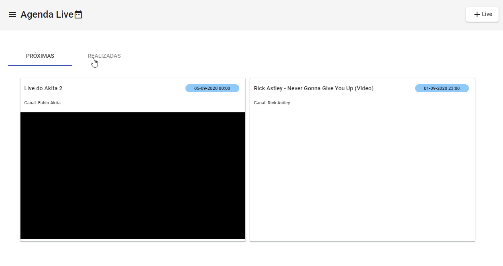

# AgendaLive

Projeto criado especialmente para aprender Angular 9, agradeço muito a Michelli Brito pelas aulas gratuitas!

O mais interessante desse projeto, foi recriar completamente do 0 o back-end em NodeJS.

------------------------------------

## 🌊   Tecnologias Utilizadas
### ✔️ Angular 9
### ✔️ NodeJs
### ✔️ Typescript
### ✔️ Sqlite3